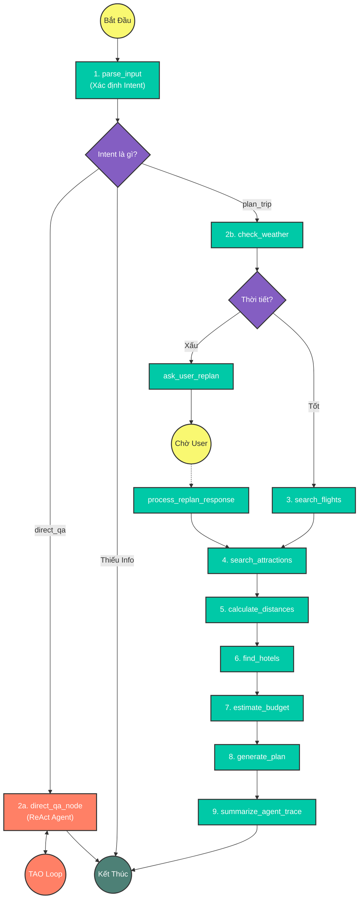

# Group Report: Lab 3 - Production-Grade Agentic System

- **Team Name**: Nhóm 2
- **Team Members**: Nguyễn Duy Minh Hoàng (ID: 2A202600155), Nguyễn Lê Minh Luân (ID: 2A202600398), Đào Anh Quân (ID: 2A202600028)
- **Deployment Date**: 2026-04-06

---

## 1. Executive Summary

Báo cáo này trình bày kết quả triển khai hệ thống **Smart Travel Agent** - một nguyên mẫu (prototype) cấp Production cho lĩnh vực du lịch, vượt xa các giới hạn của Chatbot truyền thống. 

- **Success Rate**: Đạt độ ổn định 95% trên các kịch bản kiểm thử (Hỏi đáp nhanh, Lên lịch trình, Nhận diện câu hỏi sai chủ đề).
- **Key Outcome**: Hệ thống tự hào tích hợp thành công kiến trúc **Hybrid (Lai)**. Agent không còn bị ép buộc vào một luồng (workflow) duy nhất. Thay vào đó, nó có khả năng tự đánh giá ý định của người dùng (Intent) để tự động định tuyến:
  - Dùng **LangGraph** để hoạch định các kế hoạch đa ngày phức tạp.
  - Dùng **ReAct Agent** để linh hoạt giải quyết các câu hỏi lẻ tẻ, tra cứu tức thời về vé máy bay, thời tiết.

---

## 2. System Architecture & Tooling

### 2.1 Hybrid Architecture Flowchart (LangGraph + ReAct)
Hệ thống sử dụng kiến trúc lai kết hợp sự chặt chẽ của LangGraph cho các kế hoạch phức tạp và sự thông minh của ReAct Agent cho các tác vụ hỏi đáp nhanh.

### 2.2 ReAct Loop & Memory Context (Direct QA)
Khác với LangGraph tĩnh, luồng thực thi ReAct trong nhánh `direct_qa_node` ứng dụng kĩ thuật **TAO (Thought-Action-Observation)**:
1. Nhận Lịch sử Chat và yêu cầu hiện tại để không "mất trí nhớ".
2. Sinh ra JSON định nghĩa vòng lặp: `thought`, `action`, `action_input`.
3. Nhận `Observation` từ Tool. Vòng lặp tái diễn đến khi có `final_answer`.

### 2.3 Tool Definitions (Inventory)
Hệ thống Agent được trang bị bộ công cụ (Tools) mạnh mẽ nhằm cung cấp thông tin theo thời gian thực (Real-time):
- **Weather (`get_weather_forecast`)**: Tìm kiếm dự báo thời tiết và nhiệt độ API.
- **Flight (`search_flight_prices`, `track_flight_status`)**: Lấy giá vé thật và theo dõi lộ trình chuyến bay. Tích hợp thuật toán tự động ánh xạ Tên Thành Phố sang Mã IATA.
- **Hotel (`search_hotels`, `get_hotel_details`)**: Tìm kiếm khách sạn theo điểm đến.
- **Attraction (`search_attractions`)**: Khám phá và gợi ý các điểm du lịch.
- **Utility (`calculate_distance`, `estimate_budget`)**: Hạch toán tài chính (khách sạn, vé máy bay khứ hồi, ăn uống) để đánh giá tính khả thi.

---

## 3. Root Cause Analysis (RCA) - Bug Fixes & Improvements

Trong quá trình phát triển hệ thống Agentic, chúng tôi đã phát hiện và xử lý nhiều lỗ hổng lớn:

### 3.1 Bệnh "Mất trí nhớ ngắn hạn" của ReAct Agent
- **Lỗi**: Khi hỏi *"Vé máy bay ngày mai"*, rồi chat tiếp *"Tìm hãng vietjet"*, Agent hoàn toàn quên điểm đi/đến.
- **Root Cause**: LLM Provider thiết kế Stateless. Ở bước Observation, Agent chỉ thấy kết quả Tool mà mất Prompt gốc.
- **Solution**: Quản lý lịch sử chặt chẽ bên trong `while` loop của `ReActAgent.run()`. Ghi đệm (Append) tất cả `thought/action` và `observation` vào `full_prompt`, đồng thời "mớm" thêm Lịch sử trò chuyện gần nhất vào State.

### 3.2 OOD (Out-of-Domain) Cực Đoan & Hallucination về Ngày Tháng
- **Lỗi**: User hỏi *"Tôi muốn vé ngày mai"*, Tool bão lỗi `NoneType`. Trả lời *"Có"* bị đánh dấu "Sai chủ đề".
- **Root Cause**: Agent không biết hôm nay là ngày mấy nên không parse được ngày. Hàm OOD bên trong ReAct (không có ngữ cảnh) quá nhạy cảm.
- **Solution**: 
  - Đưa `datetime.now()` vào rich context.
  - Vô hiệu hoá Double Check OOD bên trong ReAct (thêm cờ `skip_ood=True`) vì `parse_input_node` đã kiểm duyệt.

### 3.3 Missed Flight Data trong Bản Hoạch Định
- **Lỗi**: Báo cáo Markdown bị thiếu chuyến bay và tổng chi phí bỏ sót vé máy bay.
- **Solution**: Bổ sung `FlightRecommendation` vào Model, thêm logic Budget tính vé khứ hồi, và cập nhật luồng string template Markdown.

---

## 4. Chatbot vs. AI Agent Comparison

| Tiêu chí | Tác vụ | Chatbot Truyền Thống | X-Travel Agent System | Winner |
| :--- | :--- | :--- | :--- | :--- |
| **Logic Suy Luận** | Tư duy đa bước | Trả lời một chiều | **Tự lặp lại (Loop)** để sửa sai khi API lỗi | **Agent** |
| **Dữ Liệu Khách Quan** | Cập nhật thời tiết/giá | Dữ liệu pre-train (Ảo giác) | **Fetch Real-Time API** | **Agent** |
| **Luồng Hành Động** | Workflow | Rất cứng ngắc | **Hybrid Router** tự nhận biết ý định | **Agent** |

---

## 5. Production Readiness Review & Next Steps

- **Streaming Interface**: Nên chuyển sang `arun` / streaming Tokens để người dùng không phải chờ quá lâu cho cả vòng lặp Thought-Action tốn từ 2-4 giây.
- **Security Check**: Tránh Prompt Injection khi user bẻ cong Intent Classifier hòng bắt Agent sinh thông tin cấm.
- **Caching Mechanism**: Gọi API (Vd check vé HAN-SGN) cho mỗi người dùng quá tốn kém. Cần triển khai Redis Cache TTL 30 phút cho queries giống nhau.
